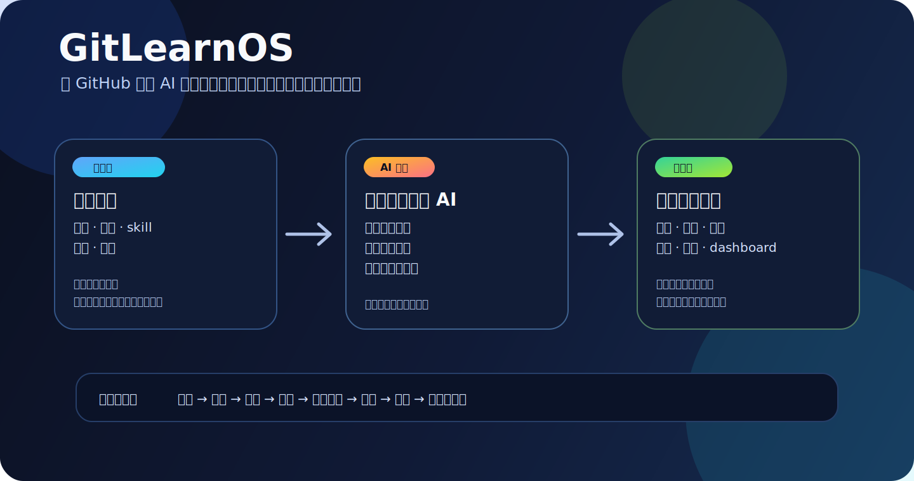

# GitLearnOS



[English](README.md)

**GitLearnOS 是挂载在现有 AI Agent 上的轻量、GitHub 原生学习套件。**

它把一个目标仓库变成可检查的学习状态：目标、来源、学习画像、知识缺口、可复用模型、复习证据与下一步行动。它由规则、Skills 和 Markdown 模板组成，不是另做一套完整的 AI 教学平台。

仓库继续保留历史名称 `Repo-as-Review-OS`，项目概念名为 **GitLearnOS**。当前状态：早期公开版本，见 [PUBLIC-ALPHA.zh-CN.md](PUBLIC-ALPHA.zh-CN.md)。

## 两分钟开始

你只需要一个有操作能力的 AI Agent、一个私有目标仓库和一个学习目标。

把下面这段发给能读取模板仓、写入目标仓的 Agent：

```text
请把 https://github.com/Guojiz/Repo-as-Review-OS 作为 GitLearnOS 模板仓库读取。
我的个人学习仓库是：<目标仓库链接>
我的第一个学习目标是：<目标>

不要在行动前通读整个模板仓库。先读 START-HERE.zh-CN.md 和 AGENTS.zh-CN.md；如果支持 Skills，再使用 skills/repo-as-review-os/SKILL.md。先检测真实权限，检查目标仓库并保护已有文件，只创建第一轮学习真正需要的最小状态，然后直接进行第一次基于证据的学习会话。不要把我的个人学习数据写进模板仓库。完成后逐项汇报改动文件。
```

在 ChatGPT Work 这类具备工具与工作区能力的环境中，Agent 应直接检查并修改已连接的目标仓库；复制粘贴只作为只读聊天环境的回退方案。

## 它是什么

```text
一个主 AI Agent
+ 一个目标 GitHub 仓库
+ 一个学习目标
+ GitLearnOS 规则与 Skills
= 一套可移植学习闭环
```

目标仓库保存长期学习状态。当前 AI 运行环境负责讲解、提问、检索、生成练习，并且只把有证据支持的学习变化写回仓库。

GitLearnOS 不是：

- AI 应用本身的替代品；
- 必须使用的多 Agent 框架；
- RAG 服务或向量数据库；
- 把所有教材与私人文件都上传进去的网盘；
- 脱离学习目标不断堆文件的笔记库。

## 学习闭环

```text
目标
→ 有来源支撑的材料
→ 学习者先尝试
→ 诊断知识缺口
→ 讲解或分级提示
→ 迁移检验
→ 证据评分
→ 更新模型、画像与复习状态
→ 下一步行动
```

最重要的规则是：**看过不等于掌握**。不能因为 AI 讲解过，或者学习者说“懂了”，就把内容标为稳定掌握。稳定进步必须有实际回忆证据，并在适合时通过迁移题验证。

## 对标 DeepTutor，但压缩成轻量套件

[港大 DeepTutor](https://github.com/HKUDS/DeepTutor) 是能力对标项目。GitLearnOS 不复刻它的完整 Runtime、前端、多 Agent、RAG 引擎、Partners 或知识平台。

GitLearnOS 只保留真正影响学习效果的轻量对应物：

| DeepTutor 的方向 | GitLearnOS 的轻量对应 |
|---|---|
| 共享个性化底座 | 一个目标仓库 + `learner-profile.md` |
| 来源支撑的学习 | `sources/` 中诚实的来源可用性与证据字段 |
| 持续变化的学习者记忆 | 由证据链接的学习画像与知识缺口文件 |
| 闭环教学 | 会话 Skill、复习证据和确定的写回规则 |
| 可扩展 Skills | 可移植的 `SKILL.md` 套件 |
| 可检查状态 | Markdown 与 Git 历史 |

原始 `zhongkao` 学习仓库继续作为实践落实基线：它证明哪些文件纪律和复习习惯在真实使用中有效。DeepTutor 决定能力方向，原始系统检验轻量实现是否真正好用。

见 [产品定位](docs/product-positioning.md) 与 [评价标准](docs/agentic-tutoring-standard.md)。

## 最小目标仓库

```text
my-gitlearnos/
├── AGENTS.md
├── dashboard.md
├── learner-profile.md
├── goals/
├── inbox/
├── sources/
├── models/
├── knowledge-gaps/
├── reviews/
├── sessions/
├── templates/
└── archive/
```

Git 不会保存空目录。搭建 Agent 应只创建第一个目标当前需要的文件与目录，其余部分等真正需要时再补。

## 选择正确入口

- **学习者：**[30 秒介绍](docs/zh-CN/30-second-intro.md) → [快速开始](QUICKSTART.zh-CN.md)
- **AI Agent：**[START-HERE.zh-CN.md](START-HERE.zh-CN.md) → [AGENTS.zh-CN.md](AGENTS.zh-CN.md) → 支持时使用 [Skill router](skills/repo-as-review-os/SKILL.md)
- **设计者或贡献者：**[产品定位](docs/product-positioning.md) → [评价标准](docs/agentic-tutoring-standard.md)

AI 不应预加载所有文档。先读两个入口文件，再检查目标学习状态，只为当前任务打开更深层资料。

## Skills 套件

可移植套件包括：

- 首次搭建与迁移；
- 实际学习会话；
- 来源处理；
- 可复用模型提取；
- 复习生成与评分；
- 仓库维护。

从 [skills/repo-as-review-os/SKILL.md](skills/repo-as-review-os/SKILL.md) 开始。实际学习会话 Skill 是教学内核，它防止项目退化成单纯的文件整理器。

## 来源、隐私与记忆

- 真实学习记录放在私有目标仓库。
- 有版权的书籍、原始扫描件、私人截图和大型原文件应保留在本地或获授权的连接来源。
- GitHub 只保存来源记录、必要的最小摘录或引用。
- `learner-profile.md` 是可检查的学习者状态锚点。
- AI 原生记忆只保存稳定偏好和长期重复模式。
- 原生记忆与目标仓库冲突时，先核对证据，再明确更新过时的一层。

## 示例

- [中文数学学习 demo](examples/zh-CN/demo-zhongkao-lite/)
- [英文论文阅读 demo](examples/en/demo-research-reading-lite/)
- [英文 SAT demo](examples/en/demo-sat-lite/)

这些都是清理后的示例，不是真实个人学习数据。

## 关键文档

- [QUICKSTART.zh-CN.md](QUICKSTART.zh-CN.md)：最短用户搭建路径
- [START-HERE.zh-CN.md](START-HERE.zh-CN.md)：短版 Agent 接手入口
- [AGENTS.zh-CN.md](AGENTS.zh-CN.md)：统一执行与安全规则
- [docs/zh-CN/runtime-self-adaptation.md](docs/zh-CN/runtime-self-adaptation.md)：按能力适配运行环境
- [docs/zh-CN/spaced-repetition.md](docs/zh-CN/spaced-repetition.md)：证据评分与下次复习规则
- [docs/product-positioning.md](docs/product-positioning.md)：轻量 DeepTutor 对标关系
- [docs/agentic-tutoring-standard.md](docs/agentic-tutoring-standard.md)：验收标准
- [templates/zh-CN/](templates/zh-CN/)：目标学习仓库模板

## 许可证

MIT License，见 [LICENSE](LICENSE)。
